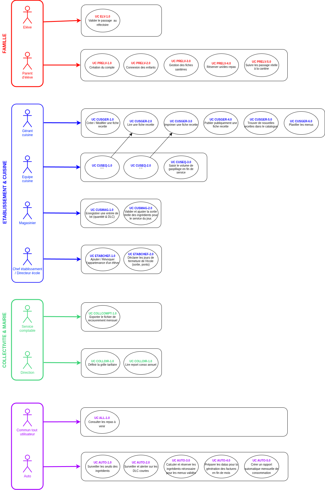

# CantineConnect — [Labo R&D / Grand Angle Métier]

[][#] 
[][#]
[][#]

> **CantineConnect** est un projet laboratoire (Sandbox / R&D) simulant un Système d'Information. L'objectif principal de ce dépôt est de servir de terrain d'expérimentation technique pour traduire des règles métiers rigoureuses, légales et hautement logistiques en une architecture logicielle scalable.

---

## À l'attention des Recruteurs & Tech Leads (Pourquoi ce Lab ?)

Ce projet dépasse le simple cadre d'un CRUD traditionnel. Il s'agit de mon **laboratoire personnel** configuré pour résoudre des problématiques d'ingénierie concrètes du monde de l'entreprise :
* **Industrialisation des Règles Métiers :** Traduction de contraintes légales strictes (santé, comptabilité publique) au cœur du domaine logiciel.
* **Architecture Orientée Domaines (DDD) :** Découpage modulaire étanche basé sur les besoins des différents acteurs (Familles, Cuisines Centrales, Logistique, Mairies)[cite: 1].
* **Urbanisation du Système :** Modélisation rigoureuse des flux, entièrement documentée et basée sur le schéma fonctionnel officiel joint au projet.

> [Modélisation macro du SI](./gestion_de_projet/02_analyses_et_conception/01_macro/cartographie_des_parcours_macro.png)

---

## Modules du Système & Règles Métiers Implémentées

Le système s'articule autour de 4 grands modules métiers autonomes, chacun répondant à des exigences strictes du cahier des charges[cite: 1] :

### 1. Le Portail Famille (Inscriptions & Réservations)
Guichet unique destiné aux parents exigeant une rigueur absolue sur la santé des enfants[cite: 1].
* **Fonctionnalités :** Dossier Unique Enfant (scolarité), Fiche Sanitaire (PAI) et calendrier de réservation annuel/mensuel[cite: 1].
* **⚠️ Règle Métier - Le Délai (J-2) :** Verrouillage automatique des réservations ou annulations moins de 48 heures avant le jour concerné (bloqué le mardi à minuit pour le jeudi midi)[cite: 1].

### 2. Restauration & Partage (Cuisine Centrale)
Espace collaboratif valorisant le savoir-faire des chefs cuisiniers de la région[cite: 1].
* **Fonctionnalités :** Catalogue des fiches techniques (recettes, portions), planification des menus hebdomadaires[cite: 1].
* **Réseau de Partage Régional :** Système d'échange permettant à un chef d'une commune (ex: Amboise) de publier une recette pour qu'un autre chef (ex: Loches) puisse l'intégrer à ses menus[cite: 1].
* **⚠️ Règle Métier - Équilibre Nutritionnel :** Algorithme de vérification des apports et de la variété sur la semaine (alternance viande/poisson, présence de légumes verts et féculents)[cite: 1].

### 3. Logistique & Gestion des Stocks
L'arrière-boutique des restaurants configurée contre le gaspillage et la rupture[cite: 1].
* **Fonctionnalités :** Inventaire en temps réel et suivi rigoureux des Dates Limites de Consommation (DLC) par lot entrant[cite: 1].
* **⚠️ Règle Métier - Déduction Automatique (FEPS) :** Dès validation d'un menu, le système calcule et déduit les ingrédients en appliquant strictement la méthode **Premier Expiré, Premier Sorti**[cite: 1].
* **⚠️ Règle Métier - Seuil de Sécurité :** Alerte et notification immédiate dès qu'un ingrédient descend sous sa quantité minimale d'alerte[cite: 1].

### 4. Administration & Facturation Mensuelle
Sécurisation des recettes des collectivités et de la trésorerie publique[cite: 1].
* **Fonctionnalités :** Grille tarifaire communale modulable (indexée sur le quotient familial) et rapports de consommation (présences réelles)[cite: 1].
* **⚠️ Règle Métier - Facturation Automatique :** Calcul automatisé en fin de mois basé sur les repas commandés (et non annulés hors délais) et génération du fichier d'export normé pour la comptabilité publique[cite: 1].

---

## Stack Technique & Choix d'Architecture

| Composant           | Technologie                      | Justification dans le cadre du Labo                                                       |
| :------------------ | :------------------------------- | :---------------------------------------------------------------------------------------- |
| **Frontend**        | [Vuejs 3 / Thymeleaf]            | Interfaces asynchrones riches, adaptées aux parcours Parents et Gestionnaires             |
| **Backend**         | [Spring Boot / Spring Batch]     | Architecture en couches (Clean / DDD) pour isoler les règles métiers strictes             |
| **Base de données** | [PostgreSQL]                     | Garantit l'acidité et l'intégrité des données financières et de santé (Allergies)         |
| **Tâches de fond**  | [Cron / Workers / Message Queue] | Pour la facturation de fin de mois et les calculs automatiques des stocks (FEPS)[cite: 1] |
| **DevOps**          | Docker, GitHub Actions           | Conteneurisation pour isolation des modules et pipeline CI/CD automatisé                  |

---

## Démarrage Rapide (Mode Local / Dev)

A venir.